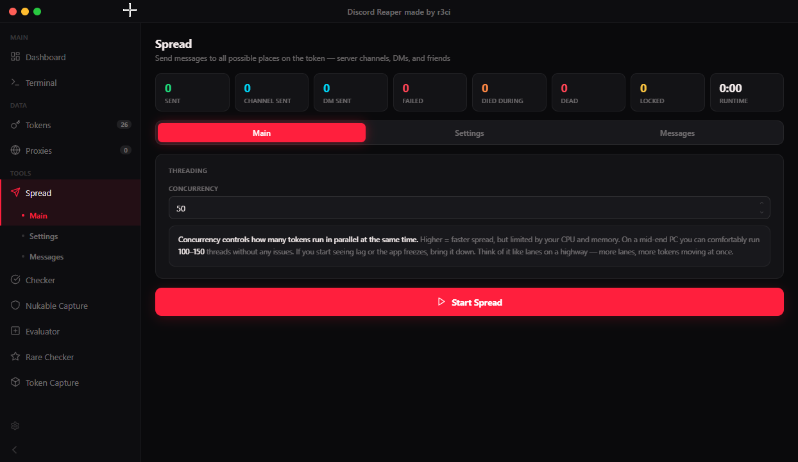

<p align="center">⭐ Star the repo for more updates ⭐</p>

<div align="center">

<br>

# DiscordReaper

**A native desktop toolkit for working with Discord tokens at scale.**
Spread messages, validate, evaluate, and profile thousands of tokens from one GUI.

<br>


<br><br>

[](https://t.me/ther3ci)
[](https://t.me/ther3ci)

</div>

---

<div align="center">

## Preview



</div>

---

## Toolkit

<table>
<tr>
<td width="33%" valign="top">

### Spread
Blast a message to every reachable place a token can post: server channels it has send access to, open DMs, and friends. Per-channel permission checks, `{ping}` and `{random}` placeholders, optional DND status, and mute-after-send.

</td>
<td width="33%" valign="top">

### Checker
Validate a token list against the Discord API and sort into **alive**, **dead**, and **locked**. Results appear the instant each token resolves.

</td>
<td width="33%" valign="top">

### Nukable Capture
Scan every guild a token belongs to and flag the ones where the account holds **Administrator**. Returns server-and-token pairs ready to act on.

</td>
</tr>
<tr>
<td width="33%" valign="top">

### Evaluator
Pull guild count, DM count, friend count, and account creation date for each valid token. Exports straight to CSV.

</td>
<td width="33%" valign="top">

### Rare Checker
Score accounts 0 to 100 on username length, creation year, and rare badges (Staff, Partner, Early Supporter, Bug Hunter, Verified Developer). Filter by any of them.

</td>
<td width="33%" valign="top">

### Token Capture
Full account snapshot per token: valid / locked status, Nitro tier, saved payment methods, badges, email, phone, and MFA. Live filtering, CSV export.

</td>
</tr>
</table>

---

## Installation

> [!IMPORTANT]
> Requires **Python 3.8+**. On Linux you also need a desktop session, `DISPLAY` or `WAYLAND_DISPLAY` must be set. Headless servers will not run the GUI.

```bash
git clone https://github.com/R3CI/DiscordReaper.git
cd DiscordReaper
pip install -r requirements.txt
python main.py
```

<details>
<summary><b>Windows: something broke</b></summary>

<br>

Run the bundled fixer, it checks your Python version, pip, the WebView2 runtime, every dependency, and all source files, then installs whatever is missing.

```bash
fix_windows.bat
```

</details>

<details>
<summary><b>Linux: something broke</b></summary>

<br>

Run the bundled fixer. It detects your distro (Debian/Ubuntu, Fedora, Arch), installs GTK3 and WebKit2GTK, then the Python dependencies.

```bash
bash fix_linux.sh
```

</details>

---

<div align="center">

### ⭐ More stars, more features

If DiscordReaper saved you time, a star genuinely helps.

[](https://github.com/R3CI/DiscordReaper/stargazers)

</div>

---

<div align="center">
<sub>

For educational and research purposes only. The developer takes no responsibility for how this tool is used. Running it against accounts or servers you do not own or have explicit permission to test violates Discord's Terms of Service and may be illegal where you live. By using this software you accept full responsibility for your actions. This tool has **no affiliation** with Discord Inc.

**Questions?** Telegram [@ther3ci](https://t.me/ther3ci) &nbsp;·&nbsp; Licensed under [MIT](LICENSE)

</sub>
</div>


