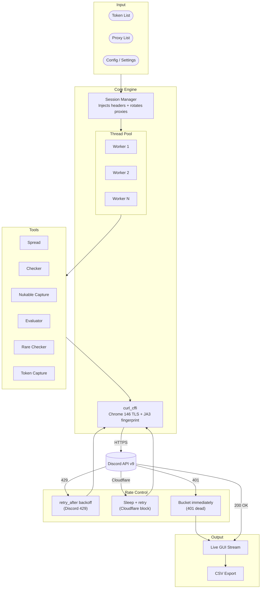
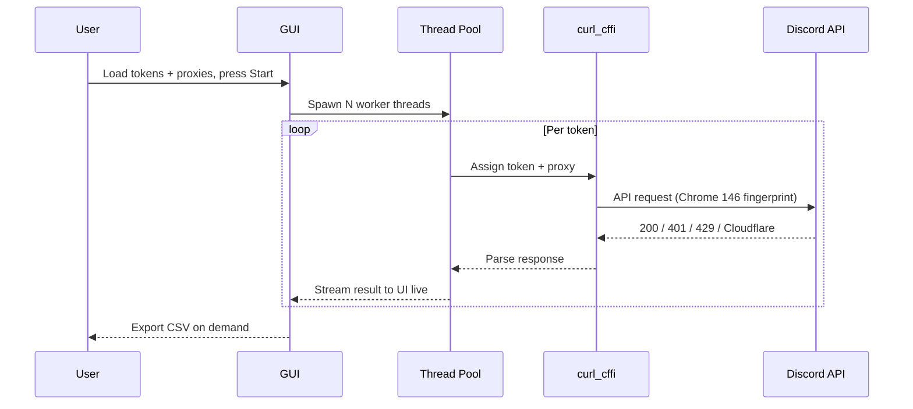

<div align="center">

[](https://github.com/R3CI/DiscordReaper/stargazers)
[](https://github.com/R3CI/DiscordReaper/network/members)
[](https://github.com/R3CI/DiscordReaper/issues)
[](https://python.org)
[](LICENSE)
[](https://github.com/R3CI/DiscordReaper)
[](https://t.me/ther3ci)

<br>

Discord token tool. Spread to servers and DMs, check validity, evaluate accounts, capture full snapshots, and surface rare usernames. Native GUI on Windows and Linux.

</div>

---

> [!WARNING]
> This project is provided for **educational and research purposes only**. The developer takes no responsibility for how this tool is used. Usage against accounts or servers you do not own or have explicit permission to test is against Discord's Terms of Service and may be illegal in your jurisdiction. By using this software you accept full responsibility for your actions.

---

## Preview

<p align="center">
  
</p>

---

## Tools

| Tool | What it does |
|---|---|
| **Spread** | Sends messages to server channels and DMs across multiple tokens concurrently. Supports `{ping}` and `{random}` placeholders, file attachments, configurable thread count and delay. Tracks sent, failed, dead, and locked per run. |
| **Checker** | Checks tokens against the Discord API, sorts into alive, dead, and locked. Results stream in live. Handles rate limits automatically. |
| **Nukable Capture** | Pulls every guild each token is in and checks for `Administrator` permission. Returns server name and token pairs where admin access was found. |
| **Evaluator** | Fetches guild count, DM count, friend count, and account creation date per token. Exports to CSV. |
| **Rare Checker** | Scores accounts 0-100 based on username length, creation year, and rare badges. Filter by length, year, score, or rare-only. |
| **Token Capture** | Full account snapshot per token: status, Nitro type, payment methods, badges, email, phone, MFA. Filterable live, exports to CSV. |

---

## Architecture



---

## How it works



Rate limit responses (`429`) back off using Discord's `retry_after` value. Cloudflare blocks trigger a short sleep and retry. Dead tokens (`401`) are immediately bucketed and never retried.

---

## Features

| Feature | Detail |
|---|---|
| GUI | pywebview, native window — no browser or Electron |
| Concurrency | Semaphore-bounded thread pool per tool, 1-1000 threads |
| Proxies | HTTP proxies from file, rotated per session |
| Rate limiting | Reads `retry_after` from Discord, sleeps exactly that long |
| Fingerprinting | Every request uses `curl_cffi` with Chrome 146 TLS/JA3 |
| Storage | Tokens, proxies, messages, settings persisted to disk |
| Export | All results dump to CSV in the app data folder |
| Platform | Windows and Linux, single codebase |

---

## Tech stack

| Package | Role |
|---|---|
| `pywebview` | Native GUI (WebKit2GTK on Linux, WebView2 on Windows) |
| `curl_cffi` | HTTP client with Chrome 146 TLS fingerprint |
| `ruamel.yaml` | Config and settings persistence |
| `threading` | Per-tool concurrent worker pools with semaphore control |

---

## Installation

> [!IMPORTANT]
> Requires **Python 3.8** or newer.

```bash
git clone https://github.com/R3CI/DiscordReaper.git
cd DiscordReaper
pip install -r requirements.txt
python main.py
```

<details>
<summary><strong>Windows — having trouble?</strong></summary>

Run `fix_windows.bat`. Checks Python version, pip, WebView2 runtime, all dependencies and source files. Installs anything missing.

</details>

<details>
<summary><strong>Linux — having trouble?</strong></summary>

Run `bash fix_linux.sh`. Detects your distro (Debian/Ubuntu, Fedora, Arch), installs GTK3 and WebKit2GTK, installs Python dependencies.

</details>

> [!NOTE]
> On Linux a desktop session is required (`DISPLAY` or `WAYLAND_DISPLAY` must be set). Headless servers will not work.

---

<div align="center">

⭐ MORE STARS = MORE FEATURES ⭐

❤️❤️ Thanks to all the people that star this repo ❤️❤️

</div>

---

<div align="center">

This repository is intended for educational purposes only.
The author does not support or encourage illegal or unethical use.
Use responsibly and at your own risk.

This tool is **not** designed to harm, exploit, or negatively affect Discord users, servers, or Discord itself.
It does **not** promote malicious activity, abuse, or any form of violation of Discord's Terms of Service.
This project has **no affiliation** with Discord Inc. in any way.

</div>

---

## Contact

Telegram: **[@ther3ci](https://t.me/ther3ci)**

---

## License

MIT - see [LICENSE](LICENSE).


